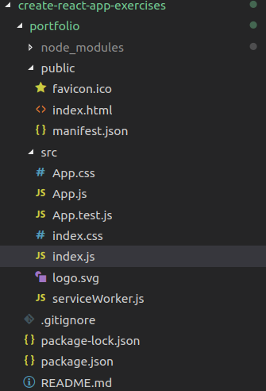

### REACT
React deals with the views in the MVC model. React is created and maintained by Facebook.

---


### BABEL and JSX
``` html
<script type="text/babel"></script>
```

Babel is language support, it translates from JSX code javascript, that will later append some html elements. 

JSX is not html and not javascript, although looks a little bit like both. JSX is a different language, thats why we need babel to compile it into html.

Babel is a very important part of the React framework. 


---

```html
    <script type="text/babel">
    ReactDOM.render(
        <h1> My portfolio </h1>,
        document.getElementById("root")
    )
    </script>
```

This will work ok. But the code below would not:


```html
    <script type="text/babel">
    ReactDOM.render(
        <h1> My portfolio </h1>
        <p> hi! </p>,
        document.getElementById("root")
    )
    
    </script>
```

This will produce the following error:
`Adjacent JSX elements must be wrapped in an enclosing tag`

To fix this we need to nested into a div, although later we will find better ways to create our react apps so we dont create unnecesary elements. 

---
### Yarn quick overview.
Yarn is another package manager commonly used. 
https://yarnpkg.com/en/

Yarn was created by facebook. 

npm and yarn are very similar. 

---
### Create React app
Create react app -> is a react boilerplate
https://github.com/facebook/create-react-app

Create react app is an npm package. To install it:

`npm i create-react-app -g`

Note we are passing the -g (global) flag so it doesnt only create it in the project.json file but globaly. 

We need to install the global install as we are going to use it to create a react application in any folder. 

Then just go to the folder where your app is going to be created and type:
`create-react app <your-app-name>`

This will create the following files:


To start the server
`npm start`

---

Note index.html is the entry point and index.js contains:

```javascript
import React from 'react';
import ReactDOM from 'react-dom';
import './index.css';
import App from './App';
import * as serviceWorker from './serviceWorker';

ReactDOM.render(<App />, document.getElementById('root'));

// If you want your app to work offline and load faster, you can change
// unregister() to register() below. Note this comes with some pitfalls.
// Learn more about service workers: http://bit.ly/CRA-PWA
serviceWorker.unregister();
```

Also note we are importing App.js which contains the App class:

```javascript
import React, { Component } from 'react';
import logo from './logo.svg';
import './App.css';

class App extends Component {
  render() {
    return (
      <div className="App">
        <header className="App-header">
          
          <p>
            Edit <code>src/App.js</code> and save to reload.
          </p>
          <a
            className="App-link"
            href="https://reactjs.org"
            target="_blank"
            rel="noopener noreferrer"
          >
            Learn React
          </a>
        </header>
      </div>
    );
  }
}
export default App;
```

---
We can create a custom function in the src folder. In this case we are going to create a Navbaf function:

```javascript   
const Navbar = () => {
    return( 
        <nav> 
            <a href="https://facebook.com">Facebook</a>
            <a href="https://Twitter.com">Twitter</a> 
            <a href="https://instagram.com">Instagram</a> 
        </nav>
    );
}

export default Navbar;
```

Note we need to type `export default <function-name>`
---
